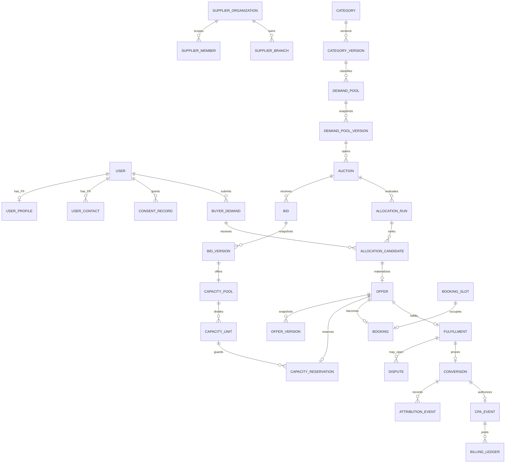

# Bidly data model

## Scope and authority

PostgreSQL is the source of truth for auctions, bids, allocation, capacity, offers, fulfillment, attribution, and billing. TypeScript domain objects express behavior; foreign keys, uniqueness, checks, immutable-history triggers, and transactions provide the final integrity boundary. Flexible category attributes may be JSON only after validation against the immutable `category_versions` schema.

Public identifiers are PostgreSQL 18 UUIDv7 values. No API resource uses a sequential identifier. The rationale is recorded in [ADR 0010](decisions/0010-uuidv7-public-identifiers.md).

## Core relationships

## Ownership and multi-tenancy

| Data                               | Owner/scope           | Enforcement                                                                  |
| ---------------------------------- | --------------------- | ---------------------------------------------------------------------------- |
| Profile, contact, consent          | user                  | separate tables; marketplace rows store only `user_id`                       |
| Supplier branches, bids, capacity  | supplier organization | membership + organization role + resource organization + state               |
| Buyer demand and offers            | buyer                 | ownership check; supplier access begins only in an accepted fulfillment flow |
| Auction rules and allocation       | platform              | moderator/admin commands; versioned snapshots                                |
| Audit, attribution, billing ledger | platform evidence     | append-only; corrections use compensating rows                               |

Supplier organization scope is always derived server-side. A client-supplied `organization_id` is only a requested resource identifier and never an authorization decision.

## Lifecycle and immutability

- `category_versions`, `auction_rule_versions`, and `allocation_policy_versions` explain historical decisions.
- `bid_versions` and `offer_versions` are immutable snapshots. Updating or deleting them raises PostgreSQL error `55000`.
- Auction, bid, offer, booking, fulfillment, and dispute changes append status-history rows.
- Attribution events, audit events, and billing ledger entries are append-only. Reversal is a new event/ledger entry.
- Buyer drafts may be hard-deleted before submission. Marketplace evidence is retained or anonymized under `retention_policies`; soft delete is not a universal mechanism.

## PII classification

| Class                       | Tables                                           | Handling                                                                       |
| --------------------------- | ------------------------------------------------ | ------------------------------------------------------------------------------ |
| Direct PII                  | `user_profiles`, `user_contacts`, `addresses`    | restricted repository/API access; never copied to auctions or logs             |
| Identity/security           | `users`, `user_sessions`, role/membership tables | server-side authorization; session material must be hashed by the auth adapter |
| Commercial confidential     | bids, capacity, offers, invoices                 | organization scoped; immutable snapshots where binding                         |
| Operational evidence        | status history, attribution, audit, ledger       | append-only, minimum safe change fields, retention-restricted                  |
| Non-sensitive configuration | categories, regions, cities, rule versions       | bounded paginated reads                                                        |

Audit `safe_changes`, outbox `safe_payload`, and notification `safe_variables` must contain identifiers and non-sensitive codes only—not raw request bodies, contacts, addresses, free-form evidence, or credentials.

## Purposeful indexes

Hot paths have indexes for pool/status intent matching, auctions by state/category, supplier bids, available capacity, expiring reservations, buyer-ranked allocation, buyer offers, bookings by supplier/slot/date, resource/actor audit lookup, and pending outbox delivery. Partial unique indexes enforce one active capacity reservation per offer and one active booking per slot. New indexes require a measured query plan; indexes are not added to every foreign key by default.

All list APIs use a bounded limit and opaque cursor. Query repositories must batch related rows and avoid per-row loading.

## Critical transaction boundaries

| Command             | Single-transaction effects                                                                                                                              |
| ------------------- | ------------------------------------------------------------------------------------------------------------------------------------------------------- |
| Accept offer        | lock idempotency record and capacity unit; validate ownership/version/expiry; conditionally reserve capacity; accept offer; append history/audit/outbox |
| Create booking      | validate accepted offer; lock slot/capacity; create one active booking; bind reservation; append history/audit/outbox                                   |
| Confirm fulfillment | lock fulfillment; append actor confirmation; derive confirmed/disputed state; append attribution evidence and outbox                                    |
| Accrue CPA          | require confirmed conversion and fulfillment evidence; create one CPA event; append balanced/compensating ledger entry                                  |
| Admin override      | require admin + explicit reason/version; write mutation and previous/new safe values to audit atomically                                                |

The implemented capacity repository demonstrates the lock/idempotency pattern. Remaining command repositories must use the same boundary before their HTTP endpoints are enabled.

## Retention and deletion

`retention_policies` versions actions per data class: `DELETE`, `ANONYMIZE`, or `RETAIN_RESTRICTED`. Deletion/anonymization workers are intentionally deferred. Legally or financially required evidence is separated from direct PII so user PII can be anonymized without destroying auction/billing integrity.
