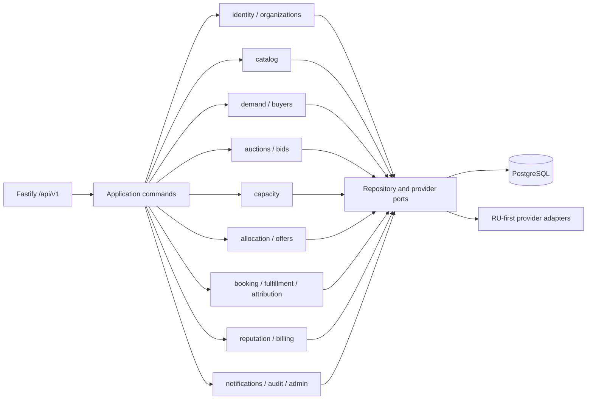

# Domain architecture

Bidly is a modular monolith with explicit module ports. It is deployed as the existing web and API processes; it is not decomposed into microservices.

## Modules and ownership

| Module          | Owns                                                        | May depend on                             |
| --------------- | ----------------------------------------------------------- | ----------------------------------------- |
| `identity`      | users, contacts, sessions, consent, global platform roles   | shared kernel, audit port                 |
| `organizations` | supplier organizations, branches, memberships, verification | identity IDs, geography IDs, audit        |
| `buyers`        | buyer profile/reliability-facing commands                   | identity, demand ports                    |
| `suppliers`     | supplier capability/performance-facing commands             | organizations, reputation ports           |
| `catalog`       | versioned category definitions and controlled schemas       | geography/shared kernel                   |
| `demand`        | demand pools, buyer demands, verification                   | catalog/identity IDs                      |
| `auctions`      | auction lifecycle, windows, rules, eligibility              | demand/catalog/org IDs                    |
| `bids`          | immutable bid versions, commitments, Total Cost, validation | auction/catalog/org IDs                   |
| `capacity`      | pools, units, reservations, allocation/release              | bid/org/branch IDs                        |
| `allocation`    | policy versions, runs, explainable candidates               | demand/bid/capacity/reputation read ports |
| `offers`        | immutable snapshots, acceptance, fallback chain             | allocation/capacity IDs                   |
| `booking`       | bookings, slots, connection requests, coverage checks       | offers/capacity IDs                       |
| `fulfillment`   | delivery state, Bidly Pass, disputes                        | booking/offer/org IDs                     |
| `attribution`   | evidence events and conversions                             | fulfillment/offer IDs                     |
| `reputation`    | buyer/supplier aggregate evidence                           | append-only outcome ports                 |
| `billing`       | CPA rules/events, supplier accounts, immutable ledger       | attribution/org IDs                       |
| `notifications` | channel-neutral requests and provider ports                 | outbox only                               |
| `audit`         | append-only safe audit and outbox events                    | shared kernel                             |
| `admin`         | policy-checked, reasoned overrides                          | module command ports + audit              |

## Dependency rules

- Public module `index.ts` files are the only supported import surface.
- Domain services use repository interfaces; PostgreSQL/Kysely types never enter domain code.
- Database adapters own SQL for their module. Cross-module reads are explicit read ports or application queries, never hidden table access.
- Controllers validate external data and construct trusted actor context; they do not implement state transitions or role checks.
- Domain code imports no vendor SDK. SMS, email, maps, storage, payments, and billing use ports.
- Events are committed to the outbox with state. In-process handlers may optimize latency but cannot be the only durable handoff.

## Shared kernel

Only stable primitives are shared: typed IDs, exact Money, UTC instants, Clock, actor/request context, domain errors, pagination, idempotency metadata, and safe audit values. Category-specific attributes remain schema-versioned data and cannot grow into an untyped general rules engine.
